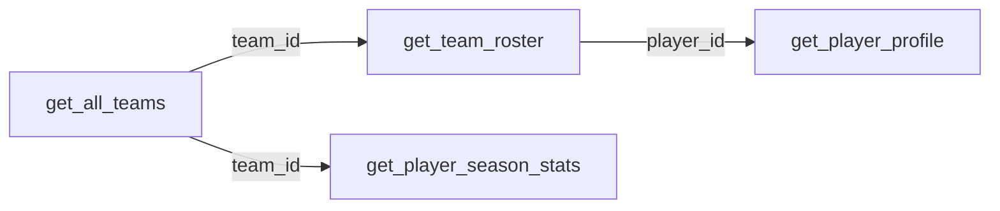

# Player Stats & Profiles

This vignette covers pulling career stats for individual players and season-level statistics for all players on a team. Player IDs come from the [team roster endpoints](teams.md).

---

## Setup

```python
from slapyshot import NHLClient
import polars as pl

client = NHLClient()

# Get a player ID from a roster
teams = client.teams.get_all_teams()
team_id = teams.filter(pl.col("name") == "Avalanche")["id"][0]

roster = client.teams.get_team_roster(team_id)
player_id = roster.filter(
    pl.col("full_name").str.contains("MacKinnon")
)["id"][0]
```

---

## Player Profile

`get_player_profile()` returns career statistics broken down by season. One row per season-team combination.

```python
profile = client.players.get_player_profile(player_id)
print(profile)
```

**Columns returned:** `player_id`, `full_name`, `primary_position`, `season_year`, `season_type`, `team_id`, `team_name`, `games_played`, `goals`, `assists`, `points`, `plus_minus`, `shots`, `penalty_minutes`

### Regular season career stats only

```python
reg_season = profile.filter(pl.col("season_type") == "REG")
print(reg_season.sort("season_year", descending=True))
```

### Most recent season

```python
latest = (
    profile
    .filter(pl.col("season_type") == "REG")
    .sort("season_year", descending=True)
    .head(1)
)
print(latest)
```

### Career totals

```python
career_totals = (
    profile
    .filter(pl.col("season_type") == "REG")
    .select(["goals", "assists", "points", "games_played", "shots"])
    .sum()
)
print(career_totals)
```

### Points per season (chart-ready)

```python
points_by_year = (
    profile
    .filter(pl.col("season_type") == "REG")
    .select(["season_year", "points", "goals", "assists"])
    .sort("season_year")
)
print(points_by_year)
```

---

## Team Season Stats

`get_player_season_stats()` returns stats for every player on a specific team for a given season. One row per player — useful for leaderboards and team comparisons.

```python
stats = client.players.get_player_season_stats(
    season_year=2025,
    season_type="REG",
    team_id=team_id,
)
print(stats)
```

**Columns returned:** `team_id`, `team_name`, `player_id`, `full_name`, `primary_position`, `games_played`, `goals`, `assists`, `points`, `plus_minus`, `shots`, `penalty_minutes`

!!! note "season_year is the starting year"
    The 2025-26 season uses `season_year=2025`. The 2024-25 season uses `season_year=2024`.

### Team scoring leaderboard

```python
leaderboard = (
    stats
    .sort("points", descending=True)
    .select(["full_name", "primary_position", "goals", "assists", "points"])
)
print(leaderboard)
```

### 20-goal scorers

```python
goal_scorers = stats.filter(pl.col("goals") >= 20)
print(goal_scorers.sort("goals", descending=True))
```

### Plus/minus leaders

```python
plus_minus = (
    stats
    .sort("plus_minus", descending=True)
    .select(["full_name", "primary_position", "plus_minus", "points"])
)
print(plus_minus)
```

### Points per game (minimum 20 games played)

```python
ppg = (
    stats
    .filter(pl.col("games_played") >= 20)
    .with_columns(
        (pl.col("points") / pl.col("games_played")).alias("points_per_game")
    )
    .sort("points_per_game", descending=True)
    .select(["full_name", "games_played", "points", "points_per_game"])
)
print(ppg)
```

### Compare two teams

Pull stats for both teams and stack them to compare:

```python
teams = client.teams.get_all_teams()

avs_id = teams.filter(pl.col("name") == "Avalanche")["id"][0]
blues_id = teams.filter(pl.col("name") == "Blues")["id"][0]

avs_stats = client.players.get_player_season_stats(2025, "REG", avs_id)
blues_stats = client.players.get_player_season_stats(2025, "REG", blues_id)

combined = pl.concat([avs_stats, blues_stats])
print(combined.sort("points", descending=True).head(20))
```

---

## Typical Workflow



!!! tip "Player IDs are permanent"
    SportRadar player IDs never change. Once you find a player's ID, you can hardcode it or store it in a config rather than looking it up every time.