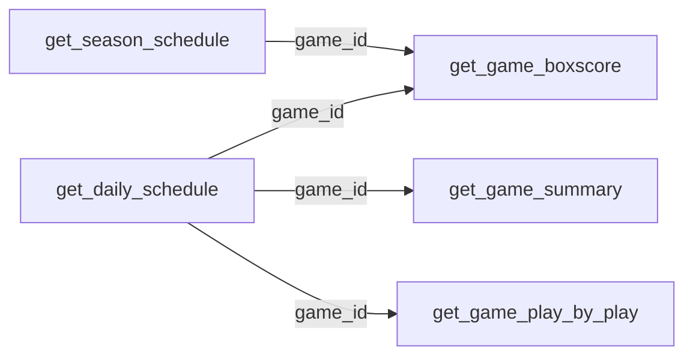

# Schedules

This vignette covers fetching game schedules — both for a single day and for an entire season. Game IDs from schedule endpoints are what you'll pass to the [Game Data](games.md) endpoints.

---

## Daily Schedule

`get_daily_schedule()` returns all games on a specific date:

```python
from slapyshot import NHLClient

client = NHLClient()
schedule = client.schedule.get_daily_schedule(2026, 3, 22)
display(schedule)
```

**Columns returned:** `id`, `status`, `scheduled`, `home_team_id`, `home_team_name`, `home_team_alias`, `away_team_id`, `away_team_name`, `away_team_alias`, `venue_id`, `venue_name`

### Check game statuses

The `status` column tells you whether a game is upcoming, live, or final:

```python
# Common status values: "scheduled", "inprogress", "closed"
display(schedule.select(["home_team_name", "away_team_name", "status"]))
```

### Get a game ID

Game IDs are what you'll pass to the game data endpoints:

```python
# First game of the day
game_id = schedule["id"][0]

# Or find a specific matchup
game_id = schedule.filter(
    pl.col("home_team_name") == "Utah Mammoth"
)["id"][0]
```

### Filter by team

```python
import polars as pl

# All games involving the Mammoth (home or away)
mammoth_games = schedule.filter(
    (pl.col("home_team_name") == "Utah Mammoth") |
    (pl.col("away_team_name") == "Utah Mammoth")
)
display(mammoth_games)
```

---

## Season Schedule

`get_season_schedule()` returns every game in a full season. The `season_year` is the **starting** year of the season:

```python
# 2025-26 regular season
season = client.schedule.get_season_schedule(2025, "REG")
display(f"Total regular season games: {len(season)}")
```

**Valid season types:**

| Code | Description |
|------|-------------|
| `PRE` | Preseason |
| `REG` | Regular season |
| `PST` | Postseason / playoffs |

!!! note
    `season_type` is case-insensitive — `"reg"`, `"REG"`, and `"Reg"` all work.

### Count games per team

```python
home_counts = (
    season
    .group_by("home_team_name")
    .agg(pl.len().alias("home_games"))
    .sort("home_games", descending=True)
)
display(home_counts)
```

### Find all games for one team

```python
tbl_games = season.filter(
    (pl.col("home_team_name") == "Tampa Bay Lightning") |
    (pl.col("away_team_name") == "Tampa Bay Lightning")
)
display(f"Lightning games this season: {len(tbl_games)}")
```

### Pull all game IDs for a team

Useful if you want to loop over games and fetch boxscores or summaries:

```python
tbl_game_ids = tbl_games["id"].to_list()

for game_id in tbl_game_ids[:5]:  # first 5 games
    boxscore = client.games.get_game_boxscore(game_id)
    display(boxscore)
```

!!! warning "Mind your rate limit"
    The free trial tier allows 1,000 requests per month. Looping over a full 82-game season schedule will use 82 of those. Use slices during development to avoid burning through your quota.

---

## Typical Workflow

