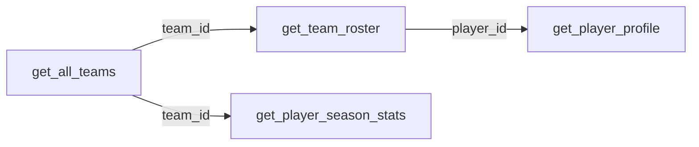

# Teams & Rosters

This vignette shows how to retrieve team information and player rosters. These endpoints are also the starting point for most other workflows — you'll need team IDs to pull rosters, and player IDs from rosters to look up individual stats.

---

## Get All Teams

`get_all_teams()` returns every NHL franchise with conference and division context:

```python
from slapyshot import NHLClient

client = NHLClient()
teams = client.teams.get_all_teams()
display(teams)
```

**Columns returned:** `id`, `name`, `market`, `alias`, `founded`, `conference_id`, `conference_name`, `division_id`, `division_name`

### Filter by conference

```python
western = teams.filter(pl.col("conference_name") == "WESTERN CONFERENCE")
display(western.select(["name", "market", "division_name"]))
```

### Filter by division

```python
atlantic = teams.filter(pl.col("division_name") == "Atlantic")
display(atlantic.select(["name", "market", "alias"]))
```

### Sort by founding year

```python
oldest = teams.sort("founded").select(["name", "market", "founded"])
display(oldest)
```

---

## Get a Team Roster

Once you have a team ID, pass it to `get_team_roster()` to get the current player list:

```python
import polars as pl

# Get the team ID for the team you want
teams = client.teams.get_all_teams()
team_id = teams.filter(pl.col("name") == "Lightning")["id"][0]

# Pull the roster
roster = client.teams.get_team_roster(team_id)
display(roster)
```

**Columns returned:** `id`, `full_name`, `first_name`, `last_name`, `jersey_number`, `primary_position`, `birth_date`, `birth_city`, `birth_country`, `height`, `weight`, `shoots_catches`, `team_id`, `team_name`

### Filter by position

```python
# All goaltenders
goalies = roster.filter(pl.col("primary_position") == "G")
display(goalies.select(["full_name", "jersey_number", "shoots_catches"]))

# All forwards (C, LW, RW)
forwards = roster.filter(pl.col("primary_position").is_in(["C", "LW", "RW"]))
display(forwards.select(["full_name", "primary_position", "jersey_number"]))
```

### Find a player ID

Player IDs are stable and can be stored for reuse. Here's how to look one up:

```python
player_id = roster.filter(
    pl.col("full_name").str.contains("Kucherov")
)["id"][0]

display(player_id)
# "92bee224-bf40-4b76-b8c2-1f690bbc1f22"
```

---

## `get_team_profile()` vs `get_team_roster()`

Both methods hit the same endpoint and return identical data. Use whichever reads more naturally in your code:

```python
# These are equivalent
roster  = client.teams.get_team_roster(team_id)
profile = client.teams.get_team_profile(team_id)
```

---

## Typical Workflow

Teams and rosters are the entry point for most SlaPyShot workflows:



!!! tip "Save IDs for later"
    Team IDs and player IDs never change once assigned by SportRadar. It's safe to hardcode them or store them in a config file so you don't have to look them up on every run.